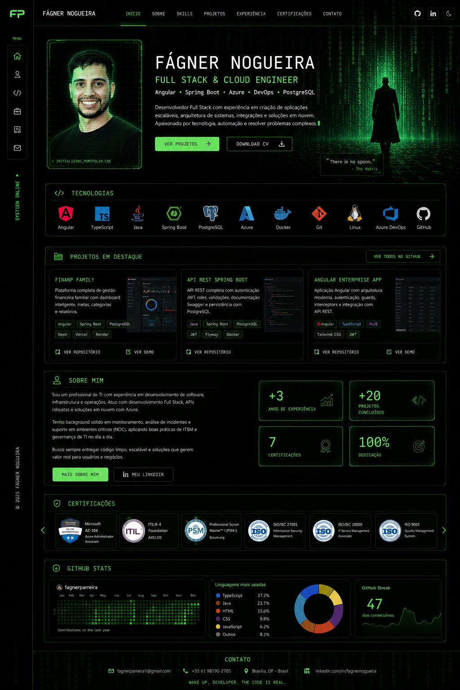

# Portfolio | Fágner Nogueira Parreira

Portfólio profissional com identidade Matrix-inspired, focado em Full Stack, Cloud e DevOps.

## Preview


## Perfil
**Fágner Nogueira Parreira**  
Full Stack & Cloud Engineer  
Angular | Spring Boot | Azure | DevOps | PostgreSQL

## Destaque de projeto
**FinanP Family**: aplicação full stack para gestão financeira familiar, com frontend publicado na Vercel, backend no Render e banco PostgreSQL no Neon.

## Tecnologias
- HTML5
- CSS3 (reset, design tokens, layout responsivo)
- JavaScript (menu mobile, scroll suave, link ativo, efeito Matrix leve)
- Angular, TypeScript, Java, Spring Boot, PostgreSQL, Azure, Azure DevOps, Docker, Git/GitHub, Linux, REST APIs, JWT

## Estrutura de pastas
```text
.
├── assets/
│   ├── img/
│   └── icons/
├── css/
│   ├── reset.css
│   ├── variables.css
│   ├── styles.css
│   └── responsive.css
├── js/
│   └── main.js
├── index.html
└── README.md
```

## Como rodar localmente
1. Clone o repositório.
2. Entre na pasta do projeto.
3. Abra o `index.html` no navegador.

Opcional com servidor local:
```bash
npx serve .
```

## Deploy
- Produção: configure para servir o `index.html` da raiz.
- URL atual de referência (GitHub Pages legado): https://fagnerparreira.github.io/fagnerparreira
- Vercel: recomendado para deploy contínuo da versão nova.

## Autor
Fágner Nogueira Parreira

## Licença
Projeto sob licença MIT. Veja [LICENSE](LICENSE).
